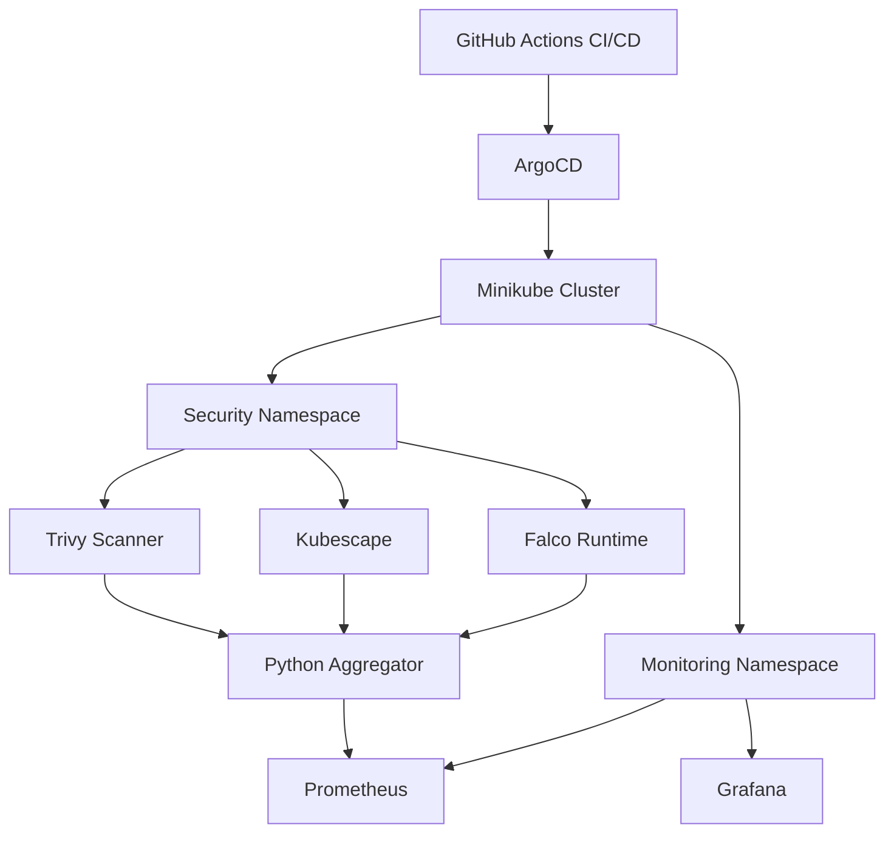

# SENTINEL - Automated Kubernetes Security Posture Engine
Live security scanning pipeline: Trivy + Kubescape on k3s/minikube

## Scan Results
- Trivy: 234 vulnerabilities (2 CRITICAL, 18 HIGH) on nginx:latest
- Kubescape: Compliance score 86/100 | MITRE: 79.91% | NSA: 76.37%

## Stack
k3s · Trivy · Kubescape · Falco · Python · GitHub Actions · Prometheus · Grafana · ArgoCD · Terraform

## Architecture
GitHub Push → GitHub Actions → Trivy Scan → Kubescape Scan
↓              ↓
trivy-results.json  kubescape-results.json
↓
Python Aggregator
↓
Unified Risk Report (CRITICAL/HIGH/MEDIUM)
↓
ArgoCD GitOps ← Prometheus ← Falco Runtime
↓
Grafana Dashboard

## Architecture

