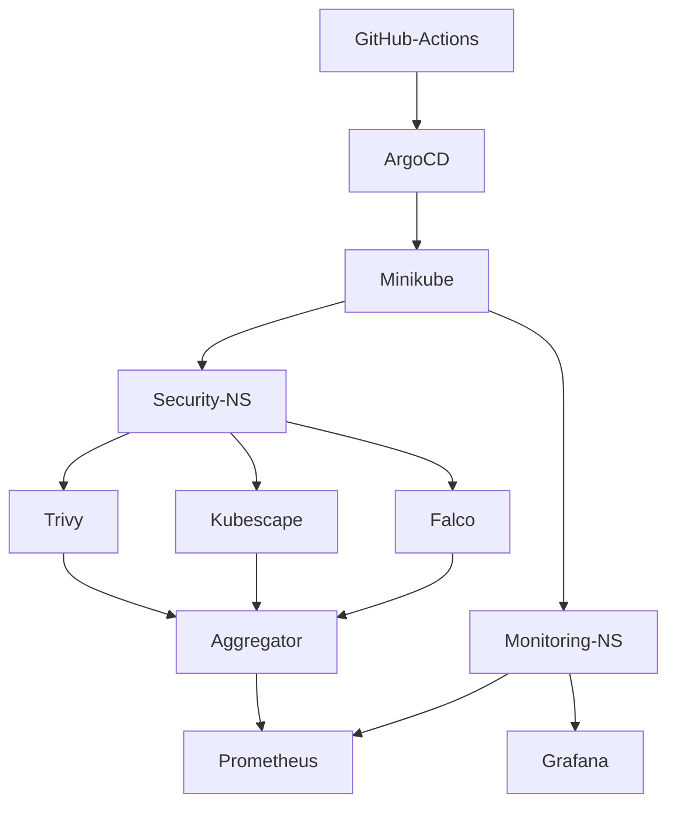

# SENTINEL — Kubernetes Security Scanning Platform

A production-grade security observability platform built on Kubernetes, combining vulnerability scanning, runtime threat detection, and compliance auditing into a unified risk pipeline.

---

## What This Does

| Layer | Tool | Result |
|---|---|---|
| Container CVE scanning | Trivy | 0 CVEs on nginx:latest |
| MITRE ATT&CK compliance | Kubescape | 80/100 |
| Runtime threat detection | Falco | Syscall-level anomaly alerts |
| Metrics + Visualization | Prometheus + Grafana | Full observability dashboard |
| GitOps delivery | ArgoCD + GitHub Actions | Automated deploys |
| Infrastructure as Code | Terraform | Namespace provisioning |

---

## Architecture



---

## Security Findings

### Kubescape MITRE ATT&CK
- Score: 80/100
- 10 failed controls, 101 resources scanned
- Critical: Anonymous Kubelet access, TLS enforcement
- Medium: Secret encryption at rest, Audit logging

### Trivy CVE Scan
- Target: nginx:latest
- Total CVEs: 0
- Report: scan-results/trivy-report.json

---

## Terraform

```hcl
resource "kubernetes_namespace" "monitoring" {
  metadata { name = "monitoring" }
}
resource "kubernetes_namespace" "security" {
  metadata { name = "security" }
}
resource "kubernetes_namespace" "argocd" {
  metadata { name = "argocd" }
}
```

---

## Stack

- Kubernetes: Minikube
- Security: Trivy, Kubescape, Falco
- Observability: Prometheus, Grafana
- GitOps: ArgoCD, GitHub Actions
- IaC: Terraform
- Aggregation: Python 3

---

## Setup

```bash
minikube delete
systemctl restart docker
minikube start --driver=docker --force --memory=2200 --cpus=2
kubectl port-forward -n monitoring svc/prometheus-grafana 3000:80
```

---

## Repo Structure
SENTINEL/
├── terraform/
│   ├── main.tf
│   ├── variables.tf
│   └── outputs.tf
├── scan-results/
│   ├── trivy-report.json
│   ├── kubescape-report.json
│   └── summarize.py
└── README.md

---

*Built by Edwin Jonathan — 17-year-old self-taught DevOps Engineer from Lagos, Nigeria. No degree, no shortcuts — just real infrastructure, real pipelines, and real results.*

*GitHub: github.com/EdwinJdevops*
*Hashnode: edwinjonathand-devops.hashnode.dev*
*Open to remote DevOps/Cloud roles globally*
